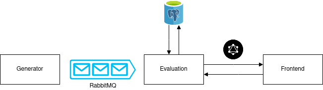
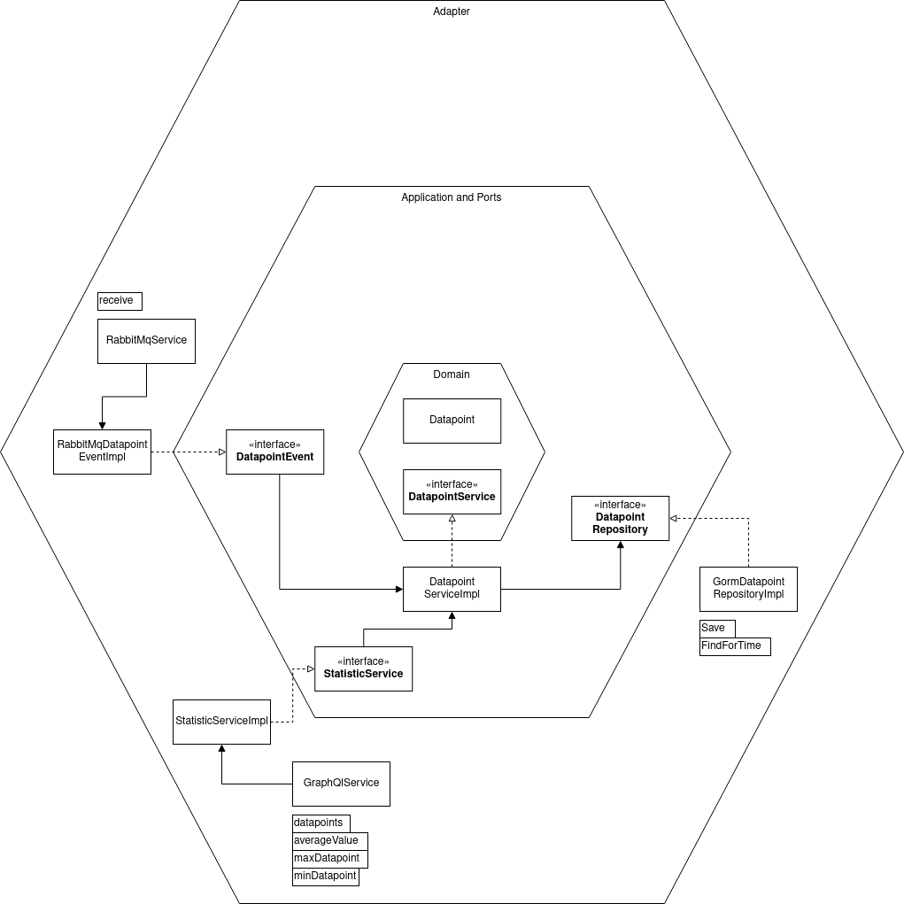

# Dataluation
Dataluation (Data Evaluation) is a simple project for graphically viewing (randomly generated) datapoints.

## Table of Contents

* [Dataluation](#dataluation)
   * [Architecture](#architecture)
   * [Quirks](#quirks)
   * [Docker](#docker)
      * [RabbitMQ](#rabbitmq)
      * [Postgres](#postgres)
      * [Generator](#generator)
      * [Evaluation](#evaluation)
      * [Frontend](#frontend)
      * [Stopping all containers](#stopping-all-containers)
   * [Docker Compose](#docker-compose)
      * [Development](#development)
      * [Production](#production)
   * [Kubernetes](#kubernetes)
   * [VM](#vm)
      * [Requirements](#requirements)
      * [Starting the services](#starting-the-services)
   * [CI](#ci)

## Architecture
This project consists of three components: a [generator](generator/README.md), an [evaluator](evaluation/README.md), and a [frontend](frontend/README.md). The generator produces random test data and sends those datapoints to a RabbitMQ queue. The evaluator takes them from there and stores them in a Postgres database. Now the frontend can request this data via GraphQL and visualize it in four different ways.



The evaluator is also structured according to a Hexagonal architecture. A diagram showing this architecture is shown below.



## Quirks
Sometimes there's a problem when writing with different mediums (i.e. Docker and Docker Compose) into a combined folder where Postgres and/or RabbitMQ isn't starting. When this happens, simply delete the `data/` directory completely.
```shell
sudo rm -rf data/
```

## Docker
On [Generator](#generator), [Evaluation](#evaluation), and the [Frontend](#frontend), it is also possible to switch from locally building the containers and starting these builds to pulling the images from GitHubs Container Registry directly. For this just switch `generator`, `evaluation`, and `frontend` to `ghcr.io/checky2010/studies.cnd/generator:main`, `ghcr.io/checky2010/studies.cnd/evaluation:main`, and `ghcr.io/checky2010/studies.cnd/frontend:main` respectively.

Before running the containers below, create a `.env` file (an example is available [here](.env.example)) and fill it accordingly.

### RabbitMQ

Start:
```shell
docker run -d \
  -p "5672:5672" \
  -p "8081:15672" \
  --env-file .env \
  -v $PWD/data/docker/rabbitmq:/var/lib/rabbitmq \
  rabbitmq:management
```

### Postgres

Start:
```shell
docker run -d \
  -p "5432:5432" \
  --env-file .env \
  -v $PWD/data/docker/postgres:/var/lib/postgresql/data \
  postgres
```

### Generator

Build:
```shell
cd ./generator
docker build -t generator .
cd ..
```

Start (depends on [rabbitmq](#rabbitmq)):
```shell
docker run -d \
  --env-file .env \
  -e RABBITMQ_HOST=host.docker.internal \
  generator
```

### Evaluation

Build:
```shell
cd ./evaluation
docker build -t evaluation .
cd ..
```

Start (depends on [rabbitmq](#rabbitmq) and [postgres](#postgres)):
```shell
docker run -d \
  -p "80:8080" \
  --env-file .env \
  -e RABBITMQ_HOST=host.docker.internal \
  -e POSTGRES_HOST=host.docker.internal \
  evaluation
```

### Frontend

Build:
```shell
cd ./frontend
docker build --build-arg API_URL=http://localhost/api -t frontend .
cd ..
```

Start (depends on [evaluation](#evaluation)):
```shell
docker run -d \
  -p "81:80" \
  --env-file .env \
  frontend
```

Now that all containers are started, the frontend is accessible at [http://localhost:81](http://localhsot:81) and the API/Playground at [http://localhost](http://localhost) and [http://localhost/playground](http://localhost/playground) respectively.

### Stopping all containers
```shell
docker stop $(docker ps -a -q)
docker rm $(docker ps -a -q)
```

## Docker Compose

### Development

[Docker Compose File](docker-compose.dev.yml)

This compose file contains all necessary dependencies for the three services, so [RabbitMQ](#rabbitmq) and [Postgresql](#postgres). This file is mainly used for development purposes or for deploying the containers separately without worrying about those dependencies.

There's also the option to build and start all containers locally. This docker compose file can be started with:
```shell
docker compose -f docker-compose.dev.full.yml up
```

### Production

[Docker Compose File](docker-compose.prod.yml)

Compared to the development configuration, this file doesn't build the images itself but pulls them from GitHubs Container Registry. It also has no open ports, except for the ingress.

Start:
```shell
sudo docker compose -f docker-compose.prod.yml up
```

> Because of some issue with ghcr.io, sudo is required for pulling the images, even if the packages are public.

After starting either of these two compose files, the frontend is accessible at [http://localhost](http://localhost) and the GraphQL Playground at [http://localhost/playground](http://localhost/playground).

They also contain [traefik](https://traefik.io/traefik/) as a Load-Balancer. All containers can be scaled at will without problems.

## Kubernetes
Installing Traefik Ingress Controller:
```shell
helm repo add traefik https://traefik.github.io/charts
helm repo update
helm install traefik traefik/traefik
```

Change the `hostPath` variables in both [postgres-pv.yaml](k8s/postgres-pv.yaml) and [rabbitmq-pv.yaml](k8s/rabbitmq-pv.yaml) to a path that's available for your Kubernetes cluster.

Applying the manifest files:
```shell
kubectl apply -f k8s/
```

The frontend should now be accessible at [http://localhost](http://localhost) and the GraphQL Playground at [http://localhost/playground](http://localhost/playground).

Deleting the manifest files:
```shell
kubectl delete -f k8s/
```

For easier access, it is advised to use [Octant](https://github.com/vmware-tanzu/octant) for navigating the cluster.

## VM
### Requirements
To run dataluation on a Virtual Machine, a few requirements must be installed first.

There is also a Docker Compose file available [in the repository](docker-compose.dev.yml) that automatically starts these requirements. When using Docker for the requirements, Docker has to be installed in the VM first. More information about installing Docker can be found [here](https://docs.docker.com/get-docker/).

#### RabbitMQ (version 3.11+)
RabbitMQ needs to be installed either locally or with the help of docker. More information about installing RabbitMQ on all available patforms is available [here](https://www.rabbitmq.com/download.html).

#### Postgres (version 15+)
Like RabbitMQ, Postgres can be installed either locally or deployed with docker. Information on how to install Postgres either way is available [here](https://www.postgresql.org/download/).

#### Golang (version 1.19+)
Golang is used for building the backend services. The installation for different operating systems can be found [here](https://go.dev/doc/install), but on Linux based Systems, it's as simple as executing the following command:
```shell
 rm -rf /usr/local/go && tar -C /usr/local -xzf go1.19.5.linux-amd64.tar.gz
```
For easier use, Go can be added to the PATH `export PATH=$PATH:/usr/local/go/bin`.

#### Flutter (version 3.3+)
Flutter is used for building the frontend. Its installation is not as simple as Go, but it can be innstalled using snap on Linux for example. The full documentation for all operating systems can be found [here](https://docs.flutter.dev/get-started/install). In the documentation, there are additional requirements that get installed, but not all of them are really necessary since the frontend will only be built for web here. Though one additional requirement is to install Chrome to run the debug server for Flutter. Alternatively you can build the frontend and serve it with web server like nginx.

### Starting the services
There are a few steps to building and starting all services.

1. Check out the repository. This can be done by cloning the repository from [GitHub](https://github.com/checky2010/studies.CND) either by setting up a SSH key or signing in on the CLI. Another option would be to download the repository and extracting it in the VM.
2. Change the directory to the root of the repository. All further commands will assume that this is done.
3. Export the necessary environment variables to the terminal. An example of them can be found [here](.env.example).
4. Execute all the following commands in a new window each to start the services.
    - Starting the evaluation service: `cd evaluation/; go run .`
    - Starting the generator service: `cd generator/; go run .`
    - Starting the frontend: `cd frontend/; flutter run -d chrome`
5. After starting the frontend, chrome should open automatically with the frontend.


## CI
Automated CI Scripts can be found in the folder `.github/workflows`. They are split according to services in [generator](.github/workflows/generator.yml), [evaluation](.github/workflows/evaluation.yml), and [frontend](.github/workflows/frontend.yml).

There are also a few tests that can be found throughout the code and which will be tested in the CI.

The results of these Scripts can be found [here](https://github.com/checky2010/studies.CND/actions).